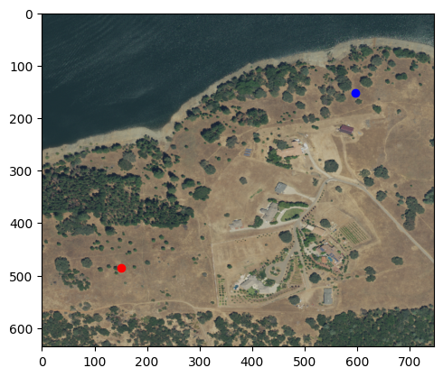
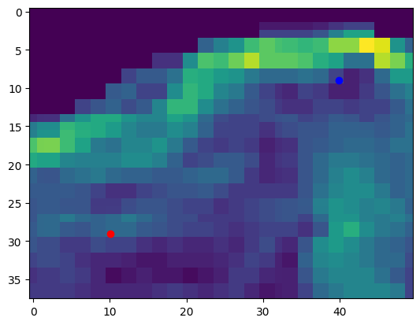
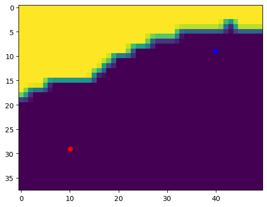
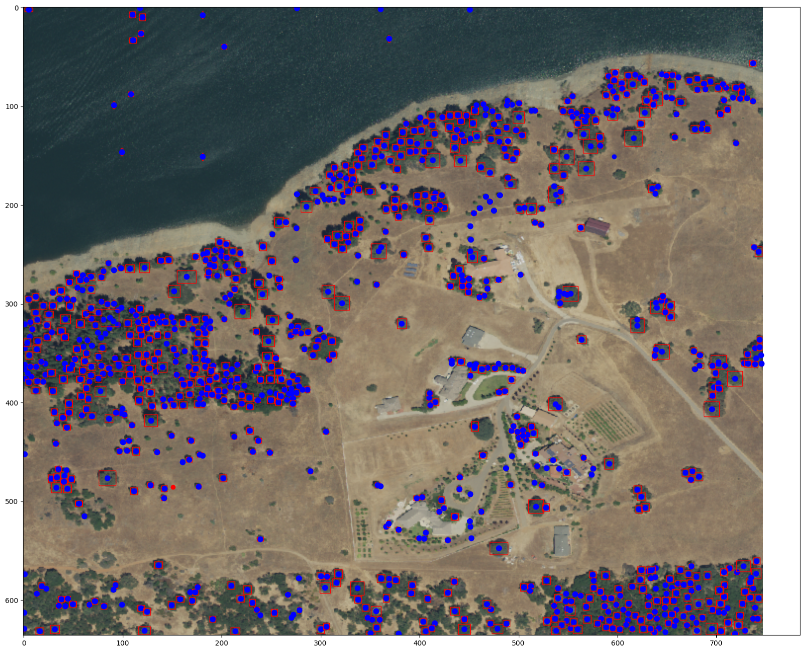
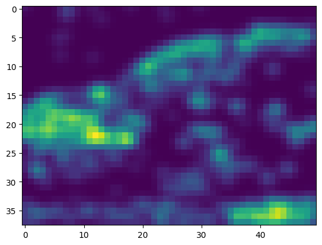
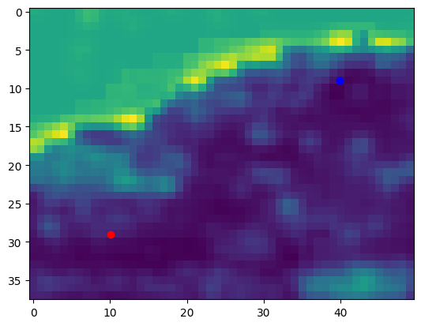
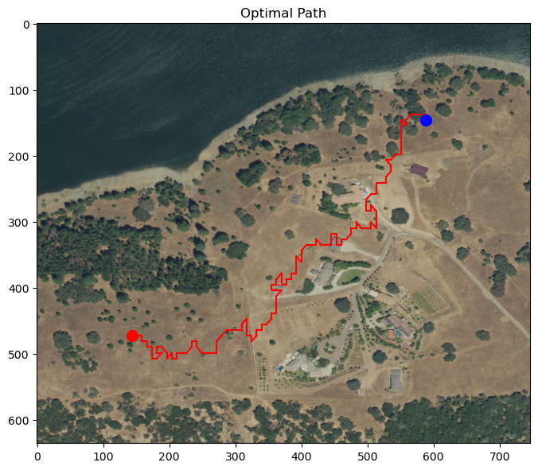

# Canopy Guide - Bio-Inspired AI Solution
 
A solution to sustainable forestry through bio-inspired route planning.
The code creates the best route from A to B taking into account multiple layers:

### Layers

- Tree density - implemented
- Slope - implemented
- Rivers - implemented
- habitat / species / biodiversity / age of tree - TODO

## How?

1. The user selects a starting point and a destination in lat,lon coordinates
2. The user runs the grid-making, followed by the route planning. This returns the best path.

## References
Uses Deepforest: Weinstein, B.G.; Marconi, S.; Bohlman, S.; Zare, A.; White, E. Individual Tree-Crown Detection in RGB Imagery Using Semi-Supervised Deep Learning Neural Networks. Remote Sens. 2019, 11, 1309

Other imaging done through Google Earth Engine API. https://developers.google.com/earth-engine/reference 

# Example

## Step 1: Retrieving Satellite Image of Chosen Location

## Step 2: Retrieving Slope Values

## Step 3: Retrieving River Locations

## Step 4: Retrieving Tree Locations Using deepforest

## Finally putting it all together to create the navigation grid:

## And running the route planning algorithm:

